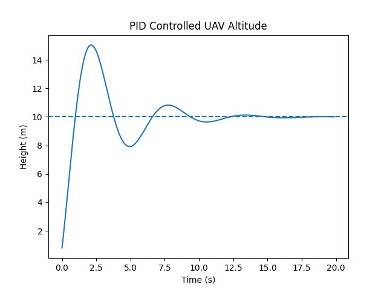
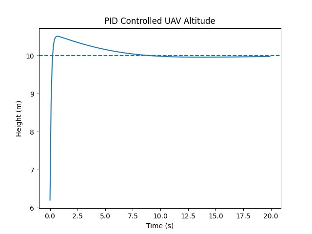

# Internship-Task-2 — UAV Flight Dynamics + PID Control

**Maincrafts Technology | UAV Design & Simulation Internship**

---

## Objective

Understand UAV flight dynamics and implement a PID control system to simulate stable altitude hold using Python.

---

## Repository Structure

```
Internship-Task-2/
│
├── pid_simulation.py                    # PID altitude simulation (starter code from task)
│
├── Deliverable1_Concept_Explanation.docx  # Flight dynamics + PID theory (2–3 page document)
│
├── Figure_1.png                         # Graph — Default tuning (Kp=2, Ki=0.1, Kd=1)
├── Figure_2.png                         # Graph — High Kp tuning (oscillation observed)
│
└── README.md
```

---

## How to Run

**Requirements:**
```
pip install numpy matplotlib
```

**Run the simulation:**
```
python pid_simulation.py
```

Change `Kp`, `Ki`, `Kd` values in the script and re-run to observe different behaviours.

---

## PID Tuning Results

| Observed Behaviour | Meaning       | Fix                    |
|--------------------|---------------|------------------------|
| Oscillation        | High Kp       | Reduce Kp / increase Kd|
| Slow response      | Low Kp        | Increase Kp            |
| Overshoot          | High Ki       | Reduce Ki              |
| Smooth stable      | Proper tuning | Lock values            |

### Figure 1 — Default Tuning (Kp=2.0, Ki=0.1, Kd=1.0)


Smooth response with minor overshoot (~10.5 m), settles at target (10 m) by ~15 s.

### Figure 2 — High Kp (Oscillation)


Drone overshoots to ~15 m, oscillates multiple times before settling. Confirms High Kp = Oscillation.

---

## Key Concepts Covered

- **Roll / Pitch / Yaw** — Three axes of drone rotation controlled by differential motor thrust
- **Throttle** — Altitude controlled by total thrust across all four motors
- **PID Control** — Proportional (react now) + Integral (fix past) + Derivative (predict future)
- **Industry use** — PX4, ArduPilot, DJI all use cascaded PID loops running at 400–1000 Hz

---

*Submitted as part of UAV Design & Simulation Internship — Task 2*
